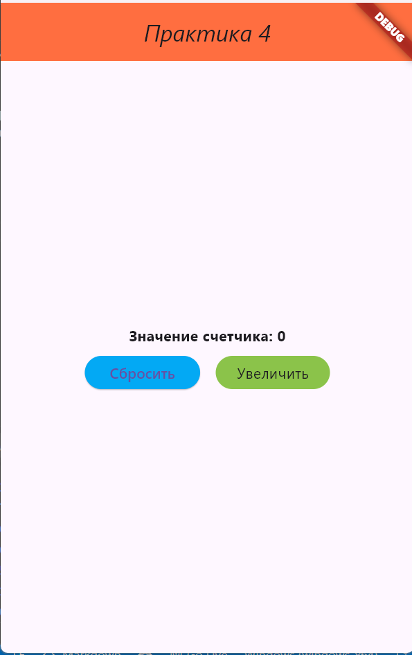
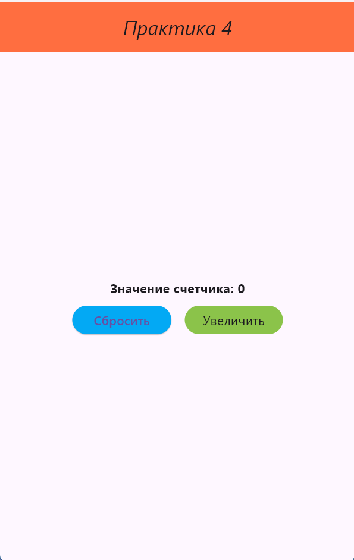

# Практическое задание № 4.

В ходе выполнения было создано приложение с счетчиком, который увеличивается при нажатии на кнопку "Увеличить" и возвращает значение 0 при нажатии на кнопку "Сбросить".

## Краткий отчет представлен в docx документе